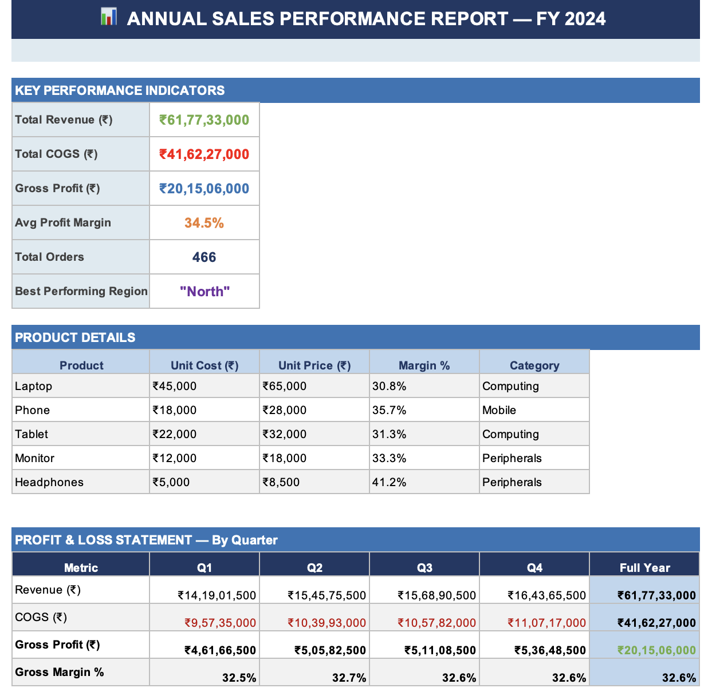

# 📊 Sales Performance Dashboard — Excel BI Project

> An end-to-end Excel Business Intelligence project built to demonstrate real-world data analysis skills using Microsoft Excel.

---

## 🎯 Project Overview

This project simulates a **retail sales dataset** for a fictional electronics company operating across 4 regions in India. The workbook contains **600+ rows of transactional data** and is structured across 6 sheets, covering the full analytics workflow — from raw data to executive reporting.

---

## 🗂️ Workbook Structure

| Sheet | Description |
|---|---|
| **Summary Report** | KPIs, P&L by quarter, VLOOKUP/INDEX-MATCH demo |
| **Raw Sales Data** | 600+ rows of order-level data with live formulas |
| **Product Lookup** | Lookup table for product cost, price, category |
| **Regional Analysis** | SUMPRODUCT-based revenue breakdown with bar chart |
| **Product Analysis** | Ranked product performance with data bars |
| **Monthly Trend** | Month-over-month revenue/profit line chart |

---

## 🧠 Excel Skills Demonstrated

### 📌 Lookup & Reference Functions
- `VLOOKUP` — Pull product cost and category from a lookup table
- `INDEX + MATCH` — Two-way lookup for flexible data retrieval
- `XLOOKUP` — Modern lookup (shown in Summary sheet)
- `SUMIF` / `SUMPRODUCT` — Conditional aggregation across datasets

### 📌 Business Metrics (P&L)
- **Revenue** = Units Sold × Unit Price
- **COGS** = Units Sold × Unit Cost
- **Gross Profit** = Revenue − COGS
- **Gross Margin %** = Gross Profit / Revenue

### 📌 Statistical Functions
- `AVERAGE` — Average profit margin
- `RANK` — Product ranking by revenue
- `COUNTA` — Count total orders

### 📌 Data Cleaning & Formatting
- Consistent number formatting (₹ currency, %, integers)
- Alternating row shading for readability
- Frozen panes and structured tables

### 📌 Conditional Formatting
- **Color Scale** on Regional Margin % (Red → Yellow → Green)
- **Data Bars** on Product Revenue column

### 📌 Charts & Visualizations
- **Clustered Bar Chart** — Revenue by Region & Quarter
- **Horizontal Bar Chart** — Gross Profit by Product
- **Line Chart** — Monthly Revenue & Profit Trend

---

## 📸 Screenshots

> ### 📌 Summary Report Dashboard
> 

---

## 🛠️ Tools Used

- **Microsoft Excel** (compatible with Excel 2019+ and Microsoft 365)
- Dataset: Simulated Indian electronics retail sales, FY 2024
- Regions: North, South, East, West
- Products: Laptop, Phone, Tablet, Monitor, Headphones

---

## 📚 Learning Source

This project was built while completing the **[Excel: Mother of Business Intelligence](https://codebasics.io/courses/bootcamp/1/excel-mother-of-business-intelligence/lecture/1131)** course by **Codebasics** as part of their Data Analytics Bootcamp.

Topics covered in the course:
- Excel Basics & Formulas
- Data Cleaning (TRIM, PROPER, etc.)
- VLOOKUP, XLOOKUP, INDEX-MATCH
- P&L and Business Metrics
- Power Query (data transformation)
- Pivot Tables & Power Pivot
- DAX Basics
- Charts & Conditional Formatting

---

## 🚀 How to Use

1. Download `Sales_Performance_Dashboard.xlsx`
2. Open in Microsoft Excel (2019 or later recommended)
3. Navigate to **Summary Report** to view the dashboard
4. Explore each sheet to see formulas and analysis in action
5. Modify the Raw Sales Data to see all formulas update automatically

---

## 👤 Author

Deepanshu Mohanty 
Aspiring Data Analyst | Learning Excel, Python & BI Tools  
📧 deepanshumohanty@gmail.com 
🔗 [LinkedIn](https://linkedin.com/in/yourprofile)

---

*⭐ If you found this helpful, please star this repository!*
